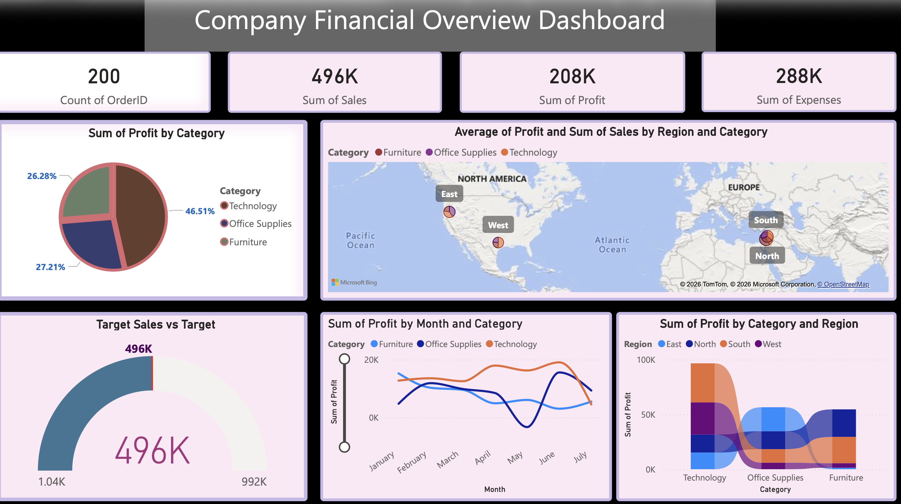

# 💰 Financial Dashboard - Power BI

## 🔹 Overview

This dashboard provides a comprehensive analysis of company financial performance, including revenue, profit, and expenses.

## 🔹 Key Features

* KPI Cards (Sales, Profit, Expenses, Orders)
* Profit analysis by category
* Region-wise financial performance
* Monthly profit trends
* Target vs actual sales comparison

## 🔹 Tools Used

* Power BI
* Data Visualization

## 🔹 Dashboard Preview

## 🔹 Business Insights

* Identified high-profit categories
* Compared regional financial performance
* Analyzed monthly profit fluctuations
* Evaluated target vs actual sales performance

## 🔹 Purpose

This project demonstrates financial data analysis and dashboard creation skills for business decision-making.

## 🔹 Contact

Open for freelancing opportunities 🚀
